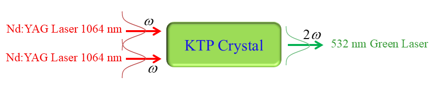

## 🧰 How to Use This Template    

Click the green **"Use this template"** button at the top of the page, then choose **"Create a new repository"**.   

This will create your own copy of this project, which you can modify freely — no need to fork!   

 
<p align="center">
  
</p>


<h1 align="center">SHG-PW-G-Coupled</h1>

<div align="center">

| **Term** | **Definition** |
|----------|----------------|
| **SHG** | Second Harmonic Generation |
| **PW** | Pulsed Wave |
| **G** | Gaussian |
</div>

&nbsp;

<div align="center">

Article title:       
**Heat coupled type II long-pulse second harmonic generation: a model for inclusion of thermal phase mismatching and thermal lensing**
</div>

&nbsp;

---

***Table of Contents***

<div>
  &nbsp;&nbsp;&nbsp;&nbsp;<a href="#1-about-this-repository"><i><b>1. About this repository</b></i></a>
</div>
&nbsp;

<div>
  &nbsp;&nbsp;&nbsp;&nbsp;<a href="#2-getting-started"><i><b>2. Getting Started</b></i></a>
</div>
&nbsp;

<div>
  &nbsp;&nbsp;&nbsp;&nbsp;<a href="#3-how-to-cite-us"><i><b>3. How to Cite Us</b></i></a>
</div>
&nbsp;


<div>
  &nbsp;&nbsp;&nbsp;&nbsp;<a href="#4-contact-information"><i><b>4. Contact Information</b></i></a>
</div>
&nbsp;

---    

## 1. About this repository


This repository contains the **toolkit and computational tools** used in the research article **"Heat coupled type II long-pulse second harmonic generation: a model for inclusion of thermal phase mismatching and thermal lensing"**, including source code, numerical solvers, and reproducibility assets.  


This toolkit provides a comprehensive time-dependent three-dimensional spatial model for the mutual interaction of type II pulsed second harmonic generation and thermal effects in potassium titanyl phosphate (KTP) crystals. The toolkit implements a complete solution for five coupled differential equations solved simultaneously using the Finite Difference Method (FDM). The coupled equations include three field equations for fundamental ordinary wave, fundamental extraordinary wave, and second harmonic wave, one heat equation with temperature-dependent thermal conductivity, and one phase equation for thermal phase mismatching.

The model considers several important physical effects: Gaussian distribution for transverse distribution of fundamental and second harmonic waves, depletion of pump waves during propagation, optical absorption of all waves, transverse Laplacian effects, evolution with successive pulses until steady-state temperature distribution is achieved, thermal cooling mechanisms including radiation and convection, and thermal lensing with associated optical aberrations. The simulation runs over time until a sufficient number of pulses enter the system to reach a steady-state thermal condition.

The numerical procedure presented here offers substantial reduction in runtime for modeling repetitively pulsed pumping toward steady-state conditions. The optimized code requires approximately 2 GB RAM and 2 hours to complete simulations on personal computers, enabling accurate investigation of how thermally induced phase mismatching and thermal lensing reduce conversion efficiency and beam quality in second harmonic generation systems.  


```
Folder PATH listing
+---citation                      <-- Contains citation materials and papers
│       1_Heat-Equation_Continu…  <-- Heat equation analytical paper
│       2_Heat-Equation_Continu…  <-- Heat equation continuous wave paper
│       3_Heat-Equation_Pulsed-…  <-- Heat equation pulsed wave paper
│       4_Phase-Mismatch_Pulsed…  <-- Phase mismatch pulsed wave paper
│       5_Ideal_Continuous-Wave…  <-- Ideal continuous wave paper
│       6_Ideal_Pulsed-Wave_Be…   <-- Ideal pulsed wave Bessel paper
│       7_Coupled_Continuous-Wa…  <-- Coupled continuous wave paper
│       README.md                 <-- Citation guidelines and information
│
+---images                        <-- Contains project images and logos
│       SHG-banner.png            <-- SHG project banner
│
+---results                       <-- Numerical simulation results
│       E_045_f_4000_Np_1_tp_50…  <-- Temperature time series data
│       E_045_f_4000_Np_1_tp_50…  <-- Temperature radial distribution data
│       E_045_f_4000_Np_1_tp_50…  <-- Temperature axial distribution data
│       E_045_f_4000_Np_1_tp_50…  <-- Phase time series data
│       E_045_f_4000_Np_1_tp_50…  <-- Phase radial distribution data
│       E_045_f_4000_Np_1_tp_50…  <-- Phase axial distribution data
│       E_045_f_4000_Np_1_tp_50…  <-- Electric field squared data for all waves
│       E_045_f_4000_Np_1_tp_50…  <-- Maximum temperature and phase data
│       E_045_f_4000_Np_1_tp_50…  <-- Psi picks and optimization data
│
+---src                           <-- Contains source code
│       Code_SHG_PW_G_Coupled.f90 <-- Fortran solver for coupled equations
│
│       main.tex                  <-- LaTeX source for research paper
│       LICENSE                   <-- Project license information
│       README.md                 <-- Project overview and documentation
│

```

## 2. Getting Started

### 2.1. Prerequisites

To run this project, you will need the following software and tools: **Fortran Compiler** (Intel Fortran ifort is recommended, or gfortran as an alternative), **Git** for cloning the repository, **Text Editor or IDE** such as VS Code or Cursor with Fortran language support, and **Terminal/Command Line Interface** for compilation and execution.

For Ubuntu/Debian systems, Intel Fortran can be installed through Intel oneAPI toolkit. Alternatively, gfortran can be installed using `sudo apt-get install gfortran`. For macOS, gfortran can be installed via `brew install gfortran`. For Windows, install MinGW-w64 or Intel Fortran Compiler.

### 2.2. Quick Start

Follow these steps to get the project running:

**Clone the Repository**: Use `git clone` to obtain a local copy of the repository, then navigate into the project directory using `cd SHG-PW-G-Coupled`.

**Navigate to Project Root**: The source code is located in the `src/` directory, but compilation should be performed from the project root directory.

**Compile the Fortran Code**: Use Intel Fortran compiler with the command `ifort -o Code_SHG_PW_G_Coupled src/Code_SHG_PW_G_Coupled.f90`. If Intel Fortran is not available, gfortran can be used as an alternative with `gfortran -o Code_SHG_PW_G_Coupled src/Code_SHG_PW_G_Coupled.f90`.

**Run the Simulation**: Execute the compiled program using `./Code_SHG_PW_G_Coupled`. The program will prompt for input parameters including energy value, frequency, number of pulses, and pulse width. These can also be modified directly in the source code for automated runs.

**View Results**: The program generates output files in the `results/` directory containing temperature distribution data, phase mismatch data, and electric field intensity data for fundamental and second harmonic waves. These files are in PLT format and can be analyzed using data visualization tools or imported into analysis software.

**Development Environment**: For enhanced development experience, open the project in VS Code or Cursor with Fortran language extensions installed for syntax highlighting and debugging capabilities. Use the integrated terminal for compilation and execution.

**Note**: Simulation parameters including energy, frequency, number of pulses, pulse width, crystal dimensions, and material properties can be modified directly in the Fortran source code (`src/Code_SHG_PW_G_Coupled.f90`) to explore different scenarios and crystal configurations. The code implements an optimized numerical procedure that significantly reduces computational requirements compared to initial implementations.


## 3. How to Cite Us
Please refer to the [**citation**](./citation/) folder for accurate citations. It contains essential guidelines for accurate referencing, ensuring accurate acknowledgement of our work.

  
## 4. Contact Information

For questions not addressed in the resources above, please connect with [Mostafa Rezaee](https://www.linkedin.com/in/mostafa-rezaee/) on LinkedIn for personalized assistance.
